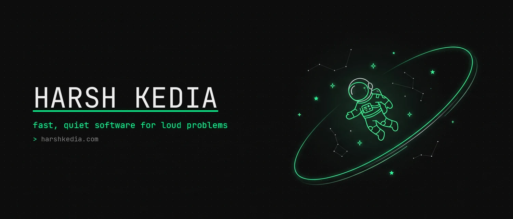

<div align="center">

[](https://harshkedia.com)

[](https://harshkedia.com)

<a href="https://harshkedia.com"></a>
<a href="https://linkedin.com/in/harshkedia17"></a>
<a href="https://x.com/harshkedia717"></a>
<a href="mailto:harshkedia717@gmail.com"></a>
<br/>


</div>

```console
$ cat about.txt
Would-be astrophysicist who kept taking machines apart: modding games,
rooting phones, flashing custom ROMs, until a web page turned out to be
something you could just make. Started with HTML, got hooked on Python,
never looked back. Systems from infra to interface, with a bias toward
the hard part in the middle.

$ harsh --best-at
  debugging     the why and the where when nothing else will
  greenfield    an empty repo to the best version of itself

$ harsh --status
  building      Tessera, the memory layer for AI agents
  learning      how GPU inference actually works, layer by layer
  history       founding engineer, twice
  open to       roles where I own hard systems end to end
```

## 🧰 Tech Stack

<div align="center">


</div>

**AI / LLM:** RAG · agent memory · agent harnesses · evals · guardrails (OWASP-LLM) · LLM tracing · model & tool routing · MCP servers · LangGraph · PyTorch

## 📊 GitHub

<div align="center">


<picture>
  <source media="(prefers-color-scheme: dark)" srcset="https://raw.githubusercontent.com/harshkedia177/harshkedia177/output/github-snake-dark.svg" />
  
</picture>

</div>

## 🚀 Building

| Project | What it is |
| --- | --- |
| **[Axon](https://github.com/harshkedia177/axon)** | Graph-powered code intelligence. Indexes any codebase into a knowledge graph and serves it over MCP so agents query the graph instead of re-reading files. 700+ stars. `pip install axoniq` |
| **[Tessera](https://github.com/harshkedia177/tessera-python)** | Long-term memory for AI agents (Python SDK + MCP server), focused on the temporal and spatial context most memory libraries skip. `pip install tessera-memory` |
| **[Design Mode](https://github.com/harshkedia177/design-mode)** | Point at your UI, tell Claude what to change, watch it happen. A visual annotation overlay that writes the change back to source. |
| **[Imagine](https://github.com/harshkedia177/image-gen-plugin)** | An image-generation skill for coding agents (Claude Code, Codex, Gemini CLI, Copilot) that create assets on the fly. |
| **[TokenViz](https://github.com/harshkedia177/tokenviz)** | GitHub-style contribution heatmaps for AI coding-tool usage. One command, no login, no tracking. `npx tokenviz` |

## 💼 Where I've shipped

- **Shoppin** · *Senior Product Engineer* : owned the systems behind an AI fashion product as it grew from discovery and try-on into full commerce and custom manufacturing. An agent-based pattern-making engine (garment to production-ready ASTM sewing pattern in minutes), an AI-native custom-clothing platform, the recommendation feed, the entire payments stack, and virtual try-on for 20K+ daily users.
- **Verbaflo.AI** · *Founding AI Engineer* : built the whole backend for a multi-modal agentic platform on FastAPI, scaled to 20K+ concurrent sessions, a hybrid RAG pipeline on Milvus, and multi-provider LLM infrastructure over gRPC that became the standard across every team.
- **Sidecar** · *Founding AI Engineer* : a 24/7 autonomous freight-forwarding agent, end to end. Email intake, structured extraction over messy docs, and an agentic quoting loop with no human in the loop. Hours to minutes, 3x outbound volume.
- **PrudentBit** · *Founding Engineer* : secure file-sharing on Azure (SAML SSO, 2FA, DLP, malware scanning) for Toyota and UCO Bank. Rewrote the backend across 130+ APIs, cutting latency from 1s to 30ms.
- **Convin.AI** · *Contract* : real-time CDC pipelines (Debezium and Kafka into Apache Pinot, in Go) for contact-center analytics.

---

<div align="center">

**More at [harshkedia.com](https://harshkedia.com)**, or read it as raw markdown at [harsh.md](https://harsh.md).

</div>
